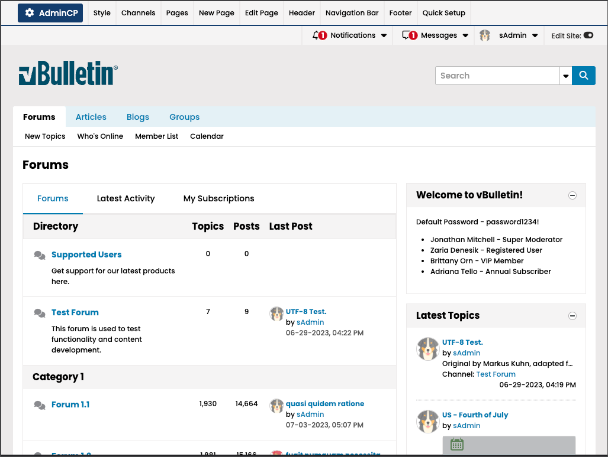
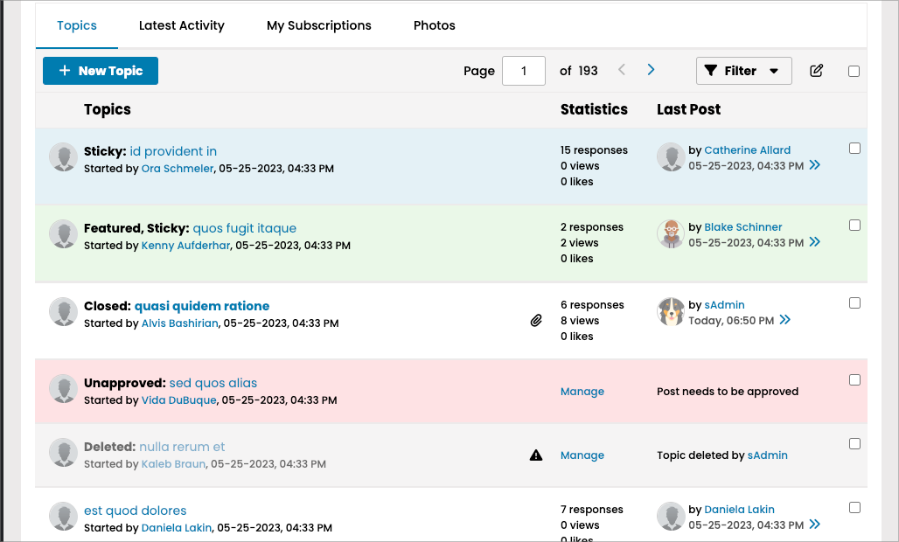
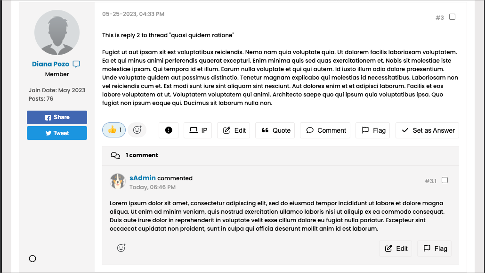
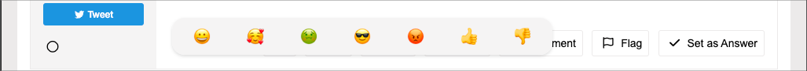

# Changes and Updates in vBulletin 6.0.0

We are pleased to announce the Release Candidate version of vBulletin 6, which is available for preview as the powering version of this forum. More details on the availability of the final version will be announced in the upcoming weeks.

## New Style

> Note: These images were taken at a width of 1024 pixels. Lower widths will affect the responsive layout.

## Modern

In vBulletin 6, we aimed to give the product a more modern look with the new style. We updated the font, colors, and icons to ensure a consistent appearance across devices.

- Font: We chose the "Poppins" font for its simplicity and readability. It is a sans-serif font.
- Colors: The style uses bold and vibrant colors to highlight primary UI elements.
- Icons: Minimal icons are used selectively to enhance the design.

### Themes

All themes are updated to be compatible with the new vBulletin 6 Default Style. Additionally, we included the Halloween and Winter themes used in the vBulletin.com Community.

### Customization

You can still customize your site using Style Variables and custom CSS. Connect customers can continue editing templates.

### Previous Styles

To maintain backward compatibility, we have provided a vBulletin 5 Style. If your custom style does not work with the new vBulletin 6 Default, you can use this as a parent style.

## Reactions

Reactions are now integrated with the reputation system and replace Likes throughout the system. Users can select from various reactions the Administrator provides, such as thumbs up, thumbs down, and other emotion-based reactions. The total number of reactions selected by users will be displayed in the post footer.

Reactions can be used with Topics, Replies, and Comments.

## Shopify Integration

You can now integrate your vBulletin community with the Shopify API. This feature allows you to import products for sale via RSS Feed or BBCode. Shopify items will include an image, description, and a buy button.

## Event Queue

We introduced a new event queue to enhance performance and move events to the server command line. The Event Queue includes tasks like creating notifications for new posts.

To enable the event queue, move do_not_upload\vbevent.php to the web server and configure it to run every minute using the server's task manager (e.g., crontab). Once the file is enabled, you can manage it in the AdminCP. Look for the "Enable Browser-Based System Events" control under Settings -> Options -> Server Settings and Optimization Options.
