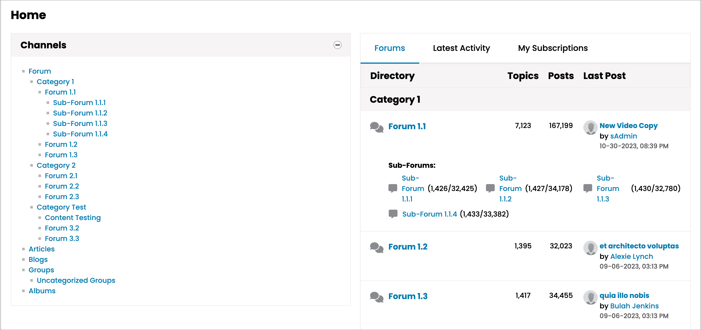
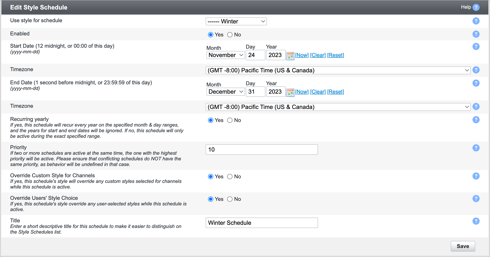

# vBulletin 6.0.2 Changes and Updates

vBulletin 6.0.2 is now available for Self-Hosted/Download Customers. vBulletin Cloud customers will be automatically upgraded soon.

## Front End Changes

### New Layout Added

Administrators can now build pages with the new 50/50 layout.

### Reactions

New reactions have been added to the system. These are: 😂, 😘,  😞, ☕

The following reactions will add to the user's reputation when awarded: 😄, 🥰, 😂, 😎, 👍.

### Style Updates

Several reported issues with the vBulletin 6 Default Style and Themes have been fixed and updated. These include:

- VB6-114 - The blue background on the active nav on mobile doesn't have a good contrast
- VB6-205 - Small Screens have extraneous borders within a channel's topic list.
- VB6-238 - namecard post count. The Namecard now supports larger post count values
- VB6-241 - Post footer links use a hard-coded font and size. Should use a Style Variable.
- VB6-251 - Table BBCode needs "overflow-x: Auto" added.
- VB6-316 - Updated the winter theme's footer copyright link color to be more legible
- VB6-319 - Winter theme sticky post text needs more contrast

---

## Back End / AdminCP Changes

### Announcements

**This feature has been removed.** Over time, this functionality has been superseded by the Notices feature. Instead of having duplicate systems for Notices to the end user, the Announcement functionality has been removed. The upgrade process will convert active Announcements to Notices. Notices offer the same options that Announcements previously provided. Notice criteria will allow you to continue showing Notices in specific forums, timed, use HTML or BBCode, and provide additional display options.

### Style Scheduling

This new feature can be found in the AdminCP under `Styles -> Style Schedules.` Using Style Schedules will allow site administrators to highlight different events on your site, whether they are holidays, community birthdays, or sporting events.  

When setting the schedule, the style selection will always start at midnight on the start date and end at 11:59 pm on the end date.

### Style Variables

New Style Variables allow you to format the post footer controls. These are listed in the Posts & Content style variable ground. The style variables added are:

- post_controls_font, post_controls_divider_color, post_controls_quote_active_text_color, post_controls_text_color, post_controls_votes_border.

> Note: Changing the post_controls_text_color variable will change non-reaction post control icons to the same color.

---

## Additional Information

### Install / Upgrade

- [Installation Instructions](https://www.vbulletin.com/forum/node/4483267)
- [Upgrade Instructions](https://www.vbulletin.com/forum/node/4483262)

### File Cleanup

After upgrading your vBulletin system, you should delete any possible obsolete files. You can obtain more information on why this is needed and instructions on how to do this in this [**topic**](https://www.vbulletin.com/forum/node/4483262) in the Installations & Upgrades forum.

### System Requirements

Minimum System Requirements

- PHP Version: 8.0.0
- MySQL Version: 5.7.9
- MariaDB Version: 10.4.0

Recommended System Requirements

- PHP Version:  8.1 or higher
- MySQL Version: 8.0 or higher
- MariaDB Version: 10.6+

For more information, see [vBulletin Connect System Requirements](https://www.vbulletin.com/forum/node/4391344).

### Current Version Support Schedule

- Active Version - 6.0.2
- Security Patch - 6.0.1
- Security Patch - 6.0.0
- Security Patch - 5.7.5

### Discussion

If you have any questions about these changes, you may discuss them here: [node]4487613[/node].

If you find an issue with the software or request a feature, please visit our [tracker](https://tracker.vbulletin.com/vbulletin6).

To receive support for your vBulletin Product, please visit our [community forums](https://www.vbulletin.com/forum/).
