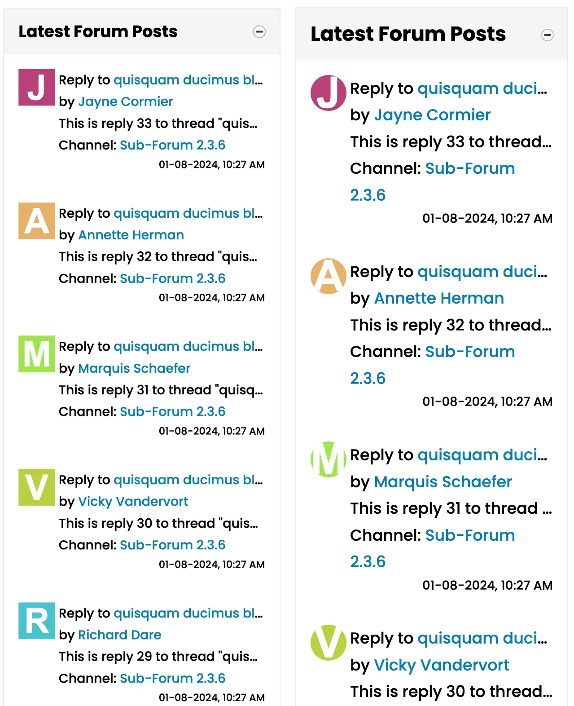
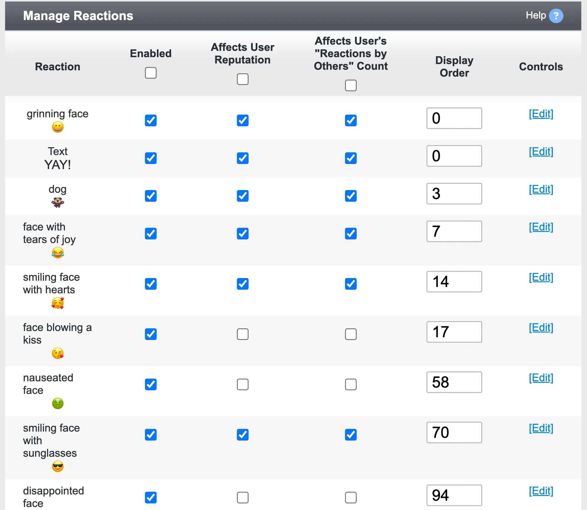
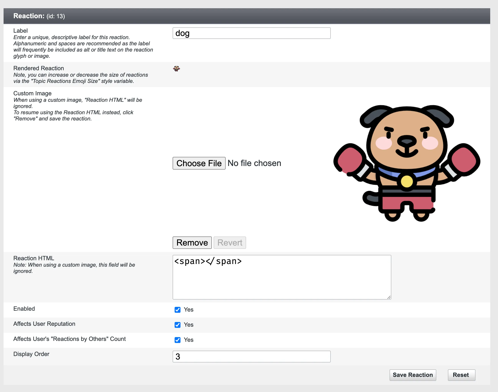

# vBulletin 6.0.3 Changes and Updates

A preview release of vBulletin 6.0.3 is available for download and testing.

## Front End Changes

### Photo Module

A new photo search module is available in Site Builder. The module will allow you to show the most recently added photos.

In addition to general search options, this module has the following configuration options:

- The module supports Horizontal and Vertical orientations.
- Administrators can set a height in the module options.
- Multiple image scaling options are available.
- An option to hide borders 
- An option to use the dominant color of the photo as its background is available.

### Default Avatars

vBulletin 6.0.3 comes with a new default avatar system. The default avatar for each user will be a generated image with the username's first letter on a colored background. If the user name changes, the avatar will change as well. These avatars support round and square rendering based on your current style variables.

In addition to this:

- The avatar border style variables have been consolidated into a single style variable called `global_avatar_border`. The default is a zero-pixel value in the provided styles and themes
- The avatar display code has been consolidated across vBulletin systems to remove code redundancy.

---

## Back End / AdminCP Changes

### Reaction Manager

The Reaction Manager in the AdminCP has been updated with the following features:

- Add/remove reactions in the AdminCP.
- Defined Labels/Names for your Reactions.
- Add Reactions by uploading custom images.
- Or using custom HTML for emoji or text reactions.
- Display Order Sorting of reactions is available.
- Determine if Reactions add to reputation or User Ranks.
- Resize via Style Variables. Bubble Border radius size|controls background border. Bubble Size - controls outside border. Emoji Size controls the overall size of the reactions.

#### Reaction Style Variables

| Name | Description |
|------|-------------|
| `topic_reactions_background_color`|Controls the background color for topic reaction bubbles.
|`topic_reactions_border`|Controls the border for topic reaction bubbles|
|`topic_reactions_bubble_border_radius_size`|Controls the border-radius applied to topic reaction bubbles.|
|`topic_reactions_bubble_size`|Controls the size (height) of topic reaction bubbles.|
|`topic_reactions_count_font`|Controls the font family, size, and style for the reaction counts.|
|`topic_reactions_emoji_size`|Controls the size (height) of the emojis or custom images for the topic reactions.|
|`topic_reactions_text_color`|Controls the text color inside topic reaction bubbles.|
|`topic_reactions_voted_background_color`|Controls the background color for a voted topic reaction bubble.|
|`topic_reactions_voted_border`|Controls the border for avoted topic reaction bubble.|
|`topic_reactions_voted_text_color`|Controls the text color inside a voted topic reaction bubble.|

### Expiring Topics

Administrators can set the topics in a channel to expire based on the last post or topic start date. You can implement this in the AdminCP under Channel Management -> Channel Manager by editing the specific channel. These changes are not retroactive and will only apply to new topics. If you wish to close old topics, you can do so in the AdminCP under Node Tools -> Close.

When a channel is configured to have automatically expiring topics, these are handled by the Daily Cleanup scheduled task. Due to the handing of scheduled tasks, some topics may remain open an extra day. Using the server task scheduler via vbcron.php can help alleviate this issue.

### Search Engine Options Consolidated

In order to handle third-party search engines and ad code snippets, the Search Engine Tools options have been reconfigured. The option group has been renamed to Search Engine and Ad Integration. Instead of providing an option for each search engine, the options have been consolidated into Header and Footer Code options. The on/off switches to embed these code snippets have been removed.

Any snippets in these options will be automatically placed in the appropriate locations when the page is built. The system will place the value of the Header option within the `<head>` tag. The system will add the value of the Footer option at the end of the page. During the upgrade to 6.0.3, any code in the previous options will be concatenated into the corresponding new option. However, it is recommended that you manually backup any custom code in these fields before upgrading.

### Google Consent and Privacy

Integration has been added to support Google's consent requirements under GDPR. Administrators can block users completely when they deny consent for all cookies. With this option, users who deny cookies are shown a dialog showing how they can use the site in the future. When using Google's consent tools, It is recommended to turn off the default privacy tools under Settings -> Options -> Privacy Options.

---

## Additional Information

### Install / Upgrade

- [Installation Instructions](https://www.vbulletin.com/forum/node/4483267)
- [Upgrade Instructions](https://www.vbulletin.com/forum/node/4483262)

### File Cleanup

After upgrading your vBulletin system, you should delete any possible obsolete files. You can obtain more information on why this is needed and instructions on how to do this in this [**topic**](https://www.vbulletin.com/forum/node/4391346) in the vBulletin 5 Installs & Upgrades forum.

### System Requirements

Minimum System Requirements

- PHP Version: 8.0.0
- MySQL Version: 5.7.10
- MariaDB Version: 10.6.0

Recommended System Requirements

- PHP Version: 8.2 or higher
- MySQL Version: 8.0 or higher
- MariaDB Version: 10.11+

For more information, see [vBulletin Connect System Requirements](https://www.vbulletin.com/forum/node/4391344).

### Current Version Support Schedule

- Active Version - 6.0.2
- Security Patch - 6.0.1
- Security Patch - 6.0.0
- Security Patch - 5.7.5

### Discussion

If you have any questions about these changes, you may discuss them here|[node]########[/node]

If you find an issue with the software or wish to request a feature, please visit our [tracker](https://tracker.vbulletin.com/vbulletin6).

To receive support for your vBulletin Product, please visit our [community forums](https://www.vbulletin.com/forum/).
