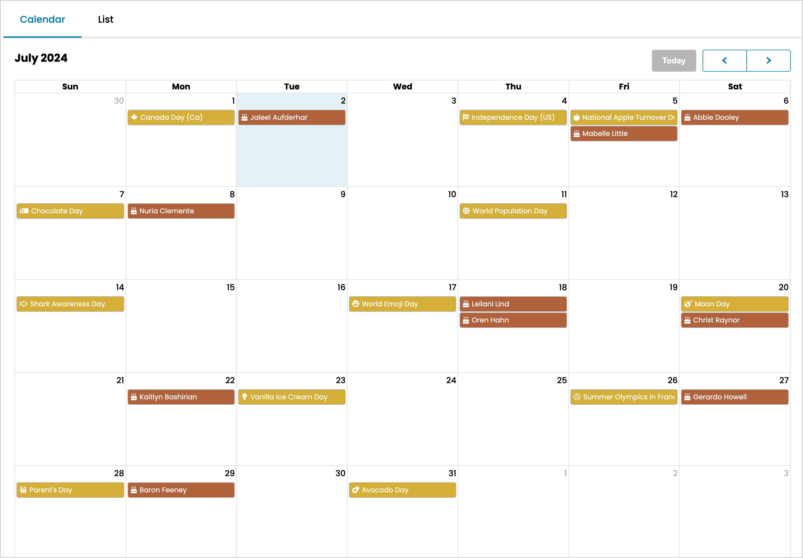

# vBulletin 6.0.6 Changes and Updates

A preview release of vBulletin 6.0.6 is available for self-hosted (download) customers. Preview releases are provided for testing purposes only and should not be used on production servers.

## Front End Changes

### Calendar Module Improvements

Site Administrators can choose to display birthdays and holidays on Calendar Modules. These are not event nodes and do not allow replies or comments. The information is for display only.

#### Birthdays

This feature shows the birthdays of users who have been active within a specific period. By default, the activity cutoff is 180 days, and Administrators can adjust this value in the Calendar module. When a user clicks or taps on a birthday in the Calendar, the user's profile will be loaded."

#### Holidays

Administrators can create holidays in the Calendar section of the Admin Control Panel (AdminCP). Each holiday can have a title, an optional description, and a date. Holidays can be recurring or assigned to a specific year. When users click or tap on a holiday in the Calendar, a popup dialog displays the details.

A new scheduled task will automatically delete non-recurring holidays after two years.

#### Style Variables

The following style variables have been added to control the colors of these event types:

- calendar_birthday_background
- calendar_birthday_background_hover
- calendar_holiday_background
- calendar_holiday_background_hover

---

## Back End / AdminCP Changes

### Holiday Manager

A new section called Calendar has been added to the AdminCP. This will allow Administrators to create new holidays to display on the Calendar. Each event can have a title, description (optional), and date. If the holiday is set to recurring, the year is ignored. Administrators can use HTML within the title and description of their events.

### User Reputation Display

The options for User Reputation Display have been merged into User Ranks. The User Reputation section of the AdminCP has been removed. If you do not wish to use the predefined ranks, you can mark them as inactive or edit them to show based on your wishes.

### Templates

A new markup tag has been added to Limited Templates, allowing administrators to trigger an action within loops. The <vb:every> tag will accomplish this. While this tag is available specifically for vBulletin Cloud, <vb:every> can also be used on self-hosted licenses. Combined with the <vb:group> tag, it effectively controls the display of content applied to template hooks.

Usage Example to show an ad after every five replies:

~~~html
<li>
<vb:every index="data.postIndex" count=5 start=0>
 The ad will be shown here.
</vb:every>
</li>
~~~

For more information, see [node]4493614[/node]

### User Promotions

The user promotion system has been updated to include an option to trigger User Promotions based on the user's last post date. This will allow administrators to remove users from active usergroups when they stop participating automatically.

---

## Additional Information

### Install / Upgrade

- [Installation Instructions](https://www.vbulletin.com/forum/node/4483267)
- [Upgrade Instructions](https://www.vbulletin.com/forum/node/4483262)

### File Cleanup

After upgrading your vBulletin system, you should delete any possible obsolete files. You can obtain more information on why this is needed and instructions on how to do this in this [**topic**](https://www.vbulletin.com/forum/node/4391346) in the vBulletin 6 Installs & Upgrades forum.

### System Requirements

Minimum System Requirements

- PHP Version: 8.1.0
- MySQL Version: 5.7.10
- MariaDB Version: 10.4.0

Recommended System Requirements

- PHP Version:  8.2 or higher
- MySQL Version: 8.0 or higher
- MariaDB Version: 10.6+

For more information, see [vBulletin Connect System Requirements](https://www.vbulletin.com/forum/node/4391344).

### Current Version Support Schedule

- Active Version - 6.0.5
- Security Patch - 6.0.4
- Security Patch - 6.0.3
- Security Patch - 5.7.5

### Discussion

If you have any questions about these changes, you may discuss them here: [node]4493528[/node]

If you encounter an issue with the software or wish to submit a feature request, please visit our [tracker](https://tracker.vbulletin.com/vbulletin6).

To receive support for your vBulletin Product, please visit our [community forums](https://www.vbulletin.com/forum/).
